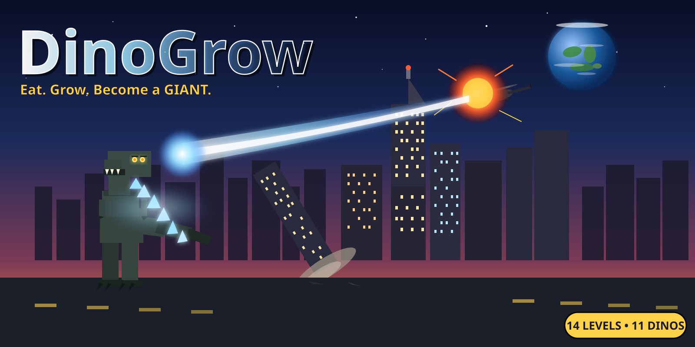

# DinoGrow



A 3D dinosaur growth game for kids. Pure HTML/CSS/JS + [Three.js](https://threejs.org/), no build step. Designed for ages 6–8 to play on an iPhone via the browser, but works on any modern device with a touch screen or keyboard.

## How to play

You start as a hatchling and grow into a GIANT by eating everything in sight.

- **Move** — joystick anywhere on the left half of the screen, or WASD on desktop.
- **Chomp** — CHOMP button or Space.
- **Signature ability** — every dino has its own move on the second action button.
- **Pause / Menu** — top-right corner.

Eat plants, mushrooms, fruit, critters, eggs, watermelons — anything smaller than you. Avoid (or once you're big enough, devour) the larger predators. Each stage gives you new abilities and stomp power. Reach **GIANT** to win the level. Every level also has a unique side objective tracked at the top of the HUD.

### Playable dinosaurs

| Species | Stats | Signature ability |
|---|---|---|
| T-Rex | Baseline | **Roar** — 22u flee aura |
| Toro (Allosaurus) | Slightly faster, smaller | **Maul** — 10u forward bite cone |
| Triceratops | Slower | **Charge** — 1.4s burst dash that smashes prey |
| Stegosaurus | Slow, plated | **Sweep** — 360° AOE consume |
| Velociraptor | Fast, small | **Pounce** — 12u forward leap + landing eat |
| Brachiosaurus | Slow, huge | **Stomp** — 16u radius enemy stun |
| Spinosaurus | Slightly bigger | **Frenzy** — 5s 2× speed + apex eat |
| Ankylosaurus | Slow, armored | **Smash** — tail-club ring stun + topples buildings |
| Parasaurolophus | Fast, light | **Call** — 35u trumpet flee aura |
| Pteranodon | Fastest, smallest | **Swoop** — 18u glide that eats along the path |
| Titan | Largest | **Plasma Breath** — energy beam, 3s cooldown |

### Levels

| Level | Theme | Objective |
|---|---|---|
| 🌳 Lost World | Forest, swamp, desert | Reach GIANT |
| 🌋 Volcano Lands | Ash, embers, red sky | Eat 12 enemy dinos |
| ❄️ Frozen Tundra | Snow, ice, pale palette | Catch 25 critters |
| 🏝️ Dino Park | Tropical jungle, rain, ranger jeeps to chomp | Chomp 5 jeeps |
| 🌙 Night Forest | Moonlight, fireflies | Hatch 3 babies |
| 🏙️ City Rampage | Destructible buildings, driving cars | Topple 20 buildings |
| 🌃 Night City | Same as above at midnight, glowing windows | Topple 30 buildings |
| 🌕 Lunar Outpost | Moon base with Earth in the sky, low gravity, stars | Topple 8 moon-base modules |

Each level has a **boss** that appears after a 45-second grace period — name, healthbar, and beacon visible from across the map. Defeat for bonus score and achievements.

### Mode toggles

All available from the start, mix and match freely:

- 🦖 **Start as Giant** — skip the growing
- 🛡️ **Invincible** — can't be eaten
- 🚀 **Speed Demon** — 2× movement
- 🍔 **Mega Food** — 3× growth from food
- 💥 **Mega Mode** — 2× the GIANT size
- 🌗 **Day / Night Cycle** — sun arcs across the sky every ~90s

## Other features

- **🥚 Egg-hatching mini-game** — find a glowing nest, tap CHOMP 5× to crack it, baby of your species hatches and helps you eat for 30s
- **🌟 Power-up berries** — speed boost, growth spurt, apex predator (eat anything)
- **🏠 Home nest at spawn** — passive growth regen while resting, compass arrow points back when far away
- **🥩 Foods** — mushrooms, cactus fruit, watermelons, beetles, pinecones, eggs
- **🏆 Achievements** — 15 unlockables tracked across all runs
- **💾 Save** — best scores, completed levels, lifetime stats, last-picked species, all in localStorage
- **🎵 Synthesized audio** — chomps, roars, ability sounds, boss music, all via Web Audio API (no asset downloads)
- **📚 Dino facts** — kid-friendly toast popups the first time you eat each species
- **📚 Tutorial** — first-run hint sequence

## Run locally

```sh
python3 -m http.server 8000
# or
npx serve .
```

Then visit `http://localhost:8000`.

> ES modules + import maps need a real HTTP server; `file://` won't work.

## Host on GitHub Pages

1. Push the repo to GitHub.
2. **Settings → Pages → Source**, pick **Deploy from a branch**, choose your branch + `/ (root)`.
3. Wait a minute. Live at `https://<your-username>.github.io/<repo>/`.

## Add to iPhone home screen

Open in Safari → Share → **Add to Home Screen**. Opens fullscreen as a PWA, no browser UI.

## Animated dinosaur models (optional)

The game ships with **procedural low-poly dinos** — hand-coded geometry, hand-coded leg/tail animation, instant load, zero asset downloads, looks polished out of the box.

You can also drop in real rigged dinosaurs from the Quaternius [Animated Dinosaurs Pack](https://quaternius.com/packs/animateddinosaurs.html) (free CC0) to get proper skeletal walk/run/idle/attack/death animations.

**One catch**: the FBX files from Quaternius ship with IK constraints that Three.js can't solve at runtime, which causes leg stretching during walk cycles. You have to re-bake the animations in Blender first.

### Quaternius setup recipe

1. **Download** the pack from [quaternius.com](https://quaternius.com/packs/animateddinosaurs.html) and unzip.
2. **Bake** the FBX files into Three.js-friendly GLB via the included script:
   - Open Blender 3.x or 4.x → **Scripting** tab
   - Open `scripts/bake-quaternius.py` and edit the two paths at the top (use forward slashes, or prefix paths with `r"..."`)
   - Run the script (`▶` or `Alt+P`). It iterates every FBX, bakes each action with **Visual Keying + Clear Constraints** (kills IK), exports GLB.
3. **Upload** the resulting `.glb` files into the repo's `/models/` folder using these filenames:
   ```
   Tyrannosaurus.glb        Spinosaurus.glb
   Triceratops.glb          Ankylosaurus.glb
   Stegosaurus.glb          Parasaurolophus.glb
   Velociraptor.glb         Pteranodon.glb
   Brachiosaurus.glb
   ```
   (Quaternius's TRex.fbx → Tyrannosaurus.glb, Apatosaurus.fbx → Brachiosaurus.glb. Rename to match.)
4. **Hard refresh**. The title screen badge under the dino picker will show **🦴 N / 9 animated GLB models loaded**.

Anything missing falls back silently to procedural. Per-species opt-out: set `modelFile: null` for that species in `src/dinos.js` (the Brachiosaurus is already opted out — its tail rig doesn't survive `SkeletonUtils.clone`).

## Structure

```
index.html                # entry point, HUD, title, touch controls, error banner
style.css                 # all styling
icon.svg                  # home-screen icon
src/
  main.js                 # bootstrap, game loop, camera, eating, abilities, bosses
  controls.js             # keyboard + floating joystick + chomp + ability button
  world.js                # ground geometry, biomes, sky shader, clouds, hills
  weather.js              # snow / embers / fireflies / rain particle pools
  water.js                # animated water shader for ponds
  entities.js             # player / enemy / critter spawning + growth stages
  dinos.js                # procedural dino meshes + SPECIES registry
  modelLoader.js          # loads GLB/FBX models, SkeletonUtils clone, mixer setup
  particles.js            # leaves, meat, dust, sparkles, debris, rubble, confetti
  audio.js                # synthesized SFX via Web Audio API
  haptics.js              # navigator.vibrate wrappers for Android
  buildings.js            # city street grid, destructible buildings, billboards
  vehicles.js             # ranger jeeps + city cars with grid-following AI
  foods.js                # mushrooms, fruit, watermelons, beetles, pinecones
  eggs.js                 # egg nests, hatching mini-game, baby dino helpers
  powerups.js             # speed / growth / apex berries
  nest.js                 # home base, compass, passive regen
  bosses.js               # named per-level bosses with healthbars
  facts.js                # kid-friendly dinosaur facts
  levels.js               # level theme registry (palette, sky, weather, objective)
  save.js                 # localStorage save (stats, achievements, best scores)
models/                   # drop baked .glb files here (optional)
  README.md               # detailed bake + install walkthrough
scripts/
  bake-quaternius.py      # Blender script: bake FBX -> Three.js-friendly GLB
  install-quaternius.sh   # copies .glb / .fbx files into /models/ with rename map
  fetch-quaternius.sh     # interactive download walkthrough
```

## Design notes

- **No fail-state spiral**: when "eaten" you respawn at one stage lower. Friendly for ages 6–8.
- **Predator/prey unified**: a bigger enemy chases you; once you outgrow them, they become food. "Avoid or fight" without explicit combat mechanics.
- **Low-poly aesthetic** keeps the game fast on iPhone; bloom + hemisphere lighting + warm fog do most of the heavy visual lifting.
- **Procedural-first**: every system has a working procedural fallback so a missing asset never breaks the game.
- **Boss grace period** (45s) before any boss appears, so young kids can grow and explore before the fight starts.
